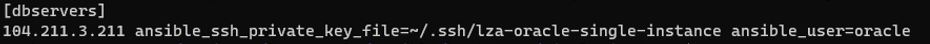

# Using ansible to configure OracleDB & ASM

Now that the required infrastructure is allocated on Azure, it is time to install & configure the Oracle DB via ansible.


On the compute source running Ubuntu or on Azure Cloud Shell, follow the steps given below:

1. Switch to the following subdirectory:
```
 $ cd ~/projects/lza-oracle/ansible/bootstrap/single_instance
```

2. Create a new file called inventory:
```
 $ touch inventory
```

3. Edit the file so that it has the following format:

```
[dbservers]

<Public IP address of the Azure VM created via terraform>  ansible_ssh_private_key_file=~/.ssh/lza-oracle-single-instance  ansible_user=oracle
```

Below is an example:




4. Start the ansible playbook
```
$ ansible-playbook playbook.yml -i inventory
```

5. If you get an error stating "ERROR! Invalid callback for stdout specified: community.general.yaml" then run the following step and then re-run the previous step.
```
 $ ansible-galaxy collection install community.general
```

6. It is acceptable to see warnings highlighted in red.


Once the installation and configuration completes, you will see a screen similar to the one below. 


7. Now you can go back to the main [README.md](../../README.md) file.


