# Testing the final configuration for Data Guard installation


1. From the compute source, ssh into the primary DB (the default name is "vm-primary-0"):
```
$ ssh -i ~/.ssh/lza-oracle-data-guard  oracle@<PUBLIC_IP_ADDRESS_OF_VM_PRIMARY_0>
```
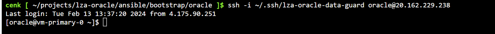

2. Check the Oracle related environment variables:
```
$ env | grep -i oracle
```
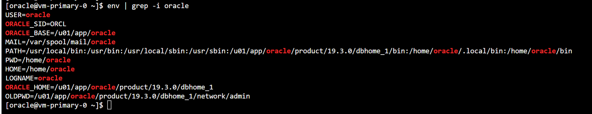

3. Connect to the database:
```
$ sqlplus / as sysdba
show user
```
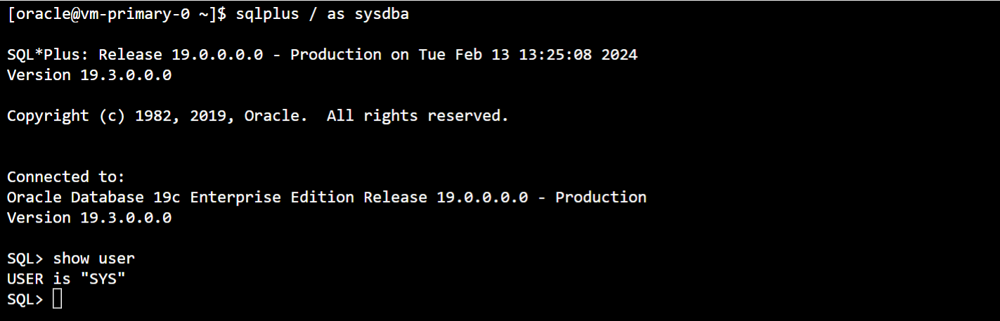

4. You can display configuration parameters related to Data Guard as follows:

```
set linesize 500 pages 100
col name format a30
col value format a100

select name, value from v$parameter
where name in ('db_name', 'db_unique_name', 'log_archive_config',
'log_archive_dest_1', 'log_archive_dest_2', 
'log_archive_dest_state_1', 'log_archive_dest_state_2', 
'remote_login_password_file', 'log_archive_format',
'log_archive_max_processes', 'fal_server',
'log_file_name_convert', 'db_file_name_convert', 'db_recovery_file_dest', 'standby_file_management')
order by 1;
```
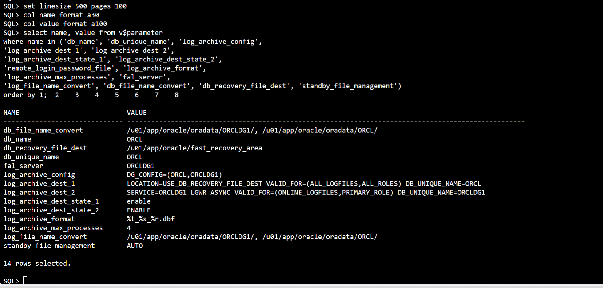

5. Check the current status of Data Guard configuration:

```
select status,instance_name,database_role, protection_mode from v$database,v$instance;
```
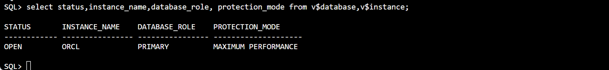

6. On the primary server, confirm that synchronization is ready to perform a switchover:

```
select dest_name,status,error from v$archive_dest where dest_name='LOG_ARCHIVE_DEST_2';
select name,value from v$parameter where name='log_archive_dest_2';
```
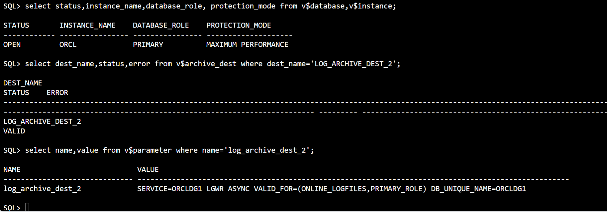

7. Check for gaps:

```
select status, gap_status  from v$archive_dest_status  where dest_id = 2;
```
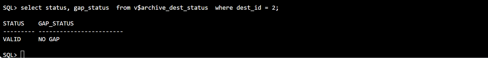

8. Verify switch over configuration:

```
alter database switchover to orcldg1 verify;
```
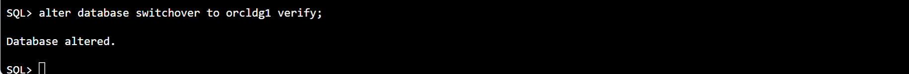


9. Perform the actual switchover:

```
alter database switchover to orcldg1;
```
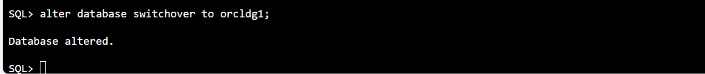


10. Next, ssh into the old standby server ("vm-secondary-0") and start the database:


```
$ ssh -i ~/.ssh/lza-oracle-data-guard  oracle@<PUBLIC_IP_ADDRESS_OF_VM_SECONDARY_0>
$ sqplus / as sysdba
alter database open;
```
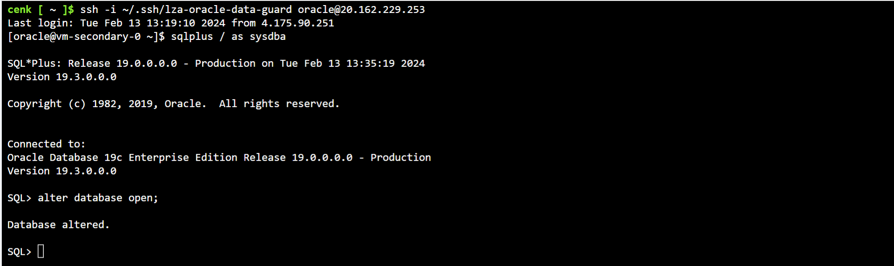


Now "vm-secodary-0" has become the primary server. You can check its new role as follows:

```
select status,instance_name,database_role, protection_mode from v$database,v$instance;
```
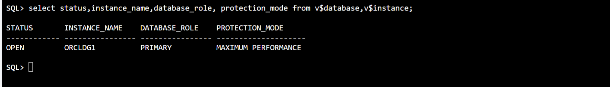

11. Finally, switch back to "vm-primary-0" and start the DB in MOUNT mode and initiate the  Redo Apply:


```
$ ssh -i ~/.ssh/lza-oracle-data-guard  oracle@<PUBLIC_IP_ADDRESS_OF_VM_PRIMARY_0>
$ sqplus / as sysdba
startup mount;
alter database recover managed standby database disconnect;
select status,instance_name,database_role, protection_mode from v$database,v$instance;
```

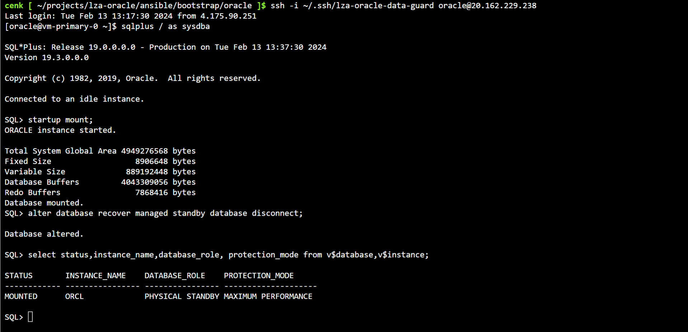

Congratulations!!! Now, you have a functional Oracle DBs running on the Azure VM with Data Guard replication.

You can follow the same procedure as above to switch back the roles. 